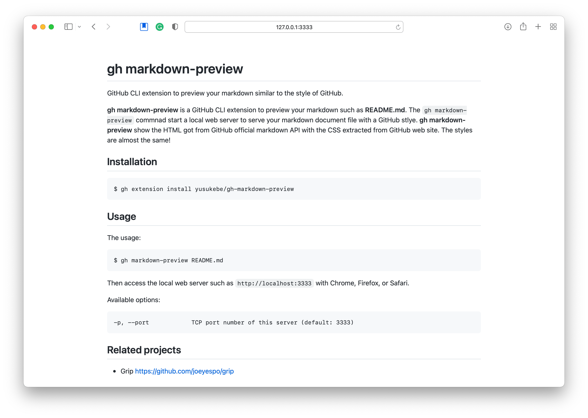

# gh markdown-preview

GitHub CLI extension to preview your markdown similar to the style of GitHub.

**gh markdown-preview** is a GitHub CLI extension to preview your markdown such as **README.md**. The `gh markdown-preview` commnad start a local web server to serve your markdown document file with a GitHub stlye. **gh markdown-preview** show the HTML got from GitHub official markdown API with the CSS extracted from GitHub web site. The styles are almost the same!



## Installation

```
$ gh extension install yusukebe/gh-markdown-preview
```

## Usage

The usage:

```
$ gh markdown-preview README.md
```

Then access the local web server such as `http://localhost:3333` with Chrome, Firefox, or Safari.

Available options:

```text
-p, --port            TCP port number of this server (default: 3333)
```

## Related projects

- Grip <https://github.com/joeyespo/grip>

## Author

Yusuke Wada <http://github.com/yusukebe>

## License

Distributed under the MIT License.
